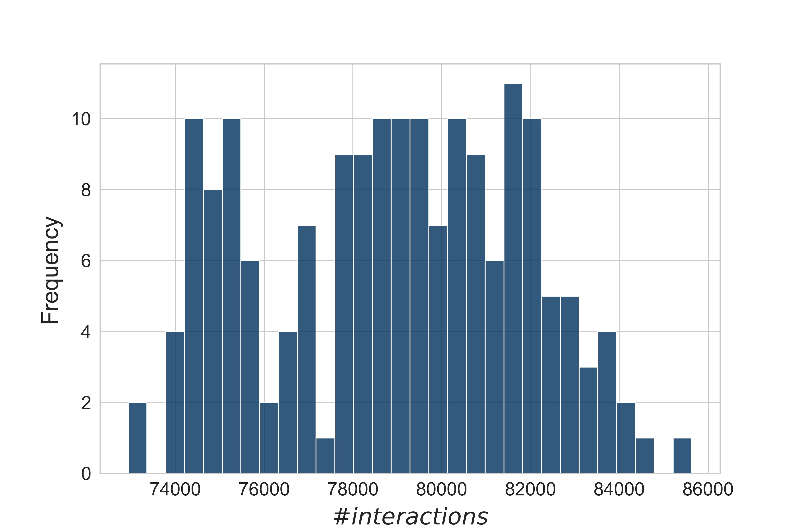
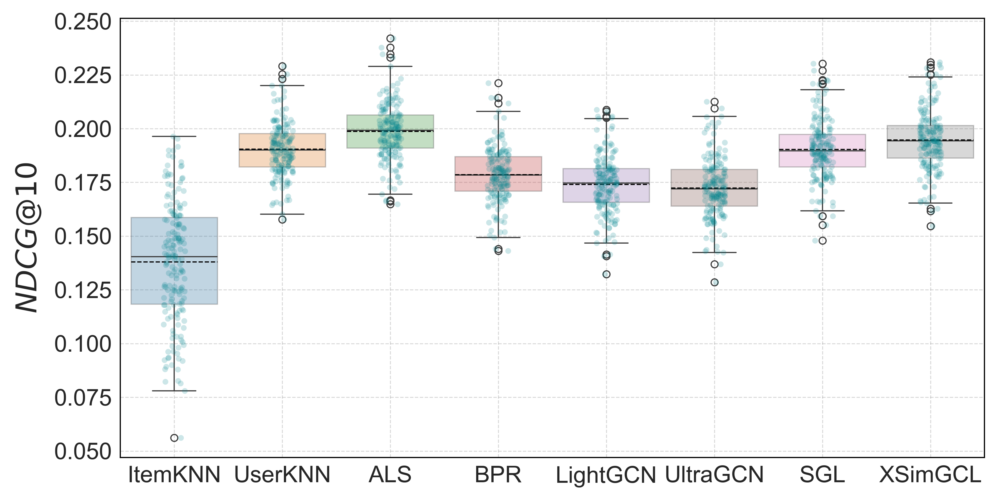
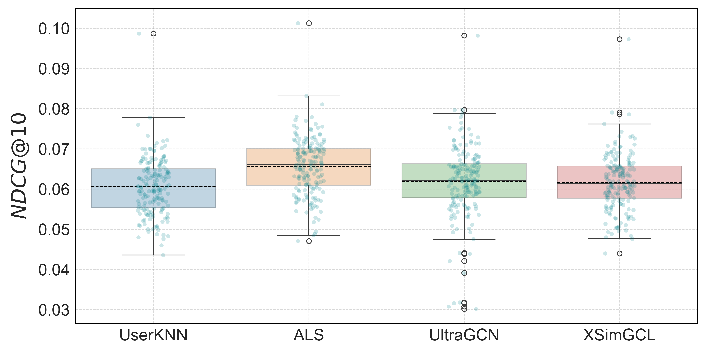
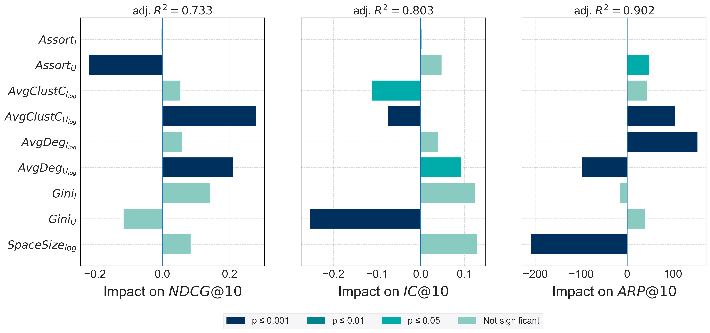
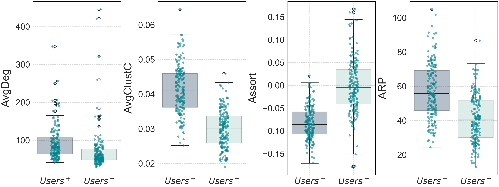

# Thesis-GNN-Rec-2025

- [Introduction](#-introduction)
- [Dataset](#-dataset)
- [Methodology](#-methodology)
- [Results](#-results)
  - [Performance](#-performance)
  - [Influence Analysis](#-influence-analysis)
- [Project Structure](#-project-structure)
- [Quick Start](#quick-start)
  - [`QuickStart.ipynb`](#via-notebook)
  - [`quick_start.py`](#via-script)
- [Setup](#setup)
  - [Setup with uv (recommended)](#setup-with-uv-recommended)
  - [Setup with uv pip](#setup-with-uv-pip)
  - [Setup with pip](#setup-with-pip)
- [Download the Data](#download-and-store-the-dataset)

#

## 🕵️ Introduction

This repository contains code and resources for my final thesis titled "Application of Graph Neural Networks to Music Recommender Systems."
Recommender Systems (RSs) play a crucial role in filtering vast amounts of data to deliver personalized content. 
Music Recommender Systems (MuRSs) enhance user experience by predicting preferences, helping users navigate extensive music libraries. Recent advancements in **Graph Neural Networks (GNNs)** have set new standards in RSs, but their evaluation remains inconsistent across datasets and splitting strategies.
This work applies traditional and GNN-based models to a **new music industry dataset**, utilizing **temporal data-splitting** for a realistic evaluation. Therefore, the recent evaluation pipeline proposed by [Malitesta et. al. (2024)](https://arxiv.org/abs/2408.11762) has been applied and extented towards a broad set of models and beyond-accuracy metrics.
**Code and results are available in this repository.**

## 💾 Dataset

MIDS ... Music Industry Dataset

- \# of customers: 58.747
- \# of records: 37.370

| dataset           | \# rows, (users, items) | sparsity | features                  |
|-------------------| ----------------------- | ----- |---------------------------|
| `MIDS` (filtered) | 17.665.904, ( 58.747, 37.370 ) | 99.1953 % | userID, itemID, timestamp |

## ⚙️ Methodology

Following the steps within the evaluation pipeline:
1. Create data splits 
2. Calculate dataset characteristics (classical & topological)
3. Apply traditional and GNNs-based models to each split (for RO & TO split)
4. Apply explanatory model (linear regression)

<figure>
  
  <figcaption><em>Distribution of the number of interactions.</em></figcaption>
</figure>

All tests have been conducted using [RecBole](https://github.com/RUCAIBox/RecBole) and [RecBole-GNN](https://github.com/RUCAIBox/RecBole-GNN).

## 💎 Results

### 📈 Performance

After hyperparameter and epoch tuning, a __Top-10 recommendation__ was applied to all users on each dataset, using a _random order split_ (70/10/20) 
and a _temporal order split_ with leave-5-out (5/5) for the validation and test sets. The following tables present the mean performance across all datasets for each model, ranked in descending order by __NDCG__(@10). 
The best values are bolded, while the second-highest values are underlined.

##### RO (70/10/20)

| Algorithm   | Pre          | MRR | NDCG            | IC              | ARP          | APLT            | 
|-------------|--------------| --- |-----------------|-----------------|--------------|-----------------| 
| ALS-MF      | __0.152966__ | __0.329359__ | __0.198749__    | 0.075893        | 57.758945    | 0.000234        |
| XSimGCL     | <u>0.150149</u> |  <u>0.329086</u> | <u>0.194740</u> | <u>0.120137</u> | 51.662866    | 0.010322        |
| AsymUserkNN | 0.145127       | 0.328943 | 0.190405        | 0.108999        | <u>74.511185</u> | <u>0.015634</u> |
| SGL         | 0.147338       |  0.319677 | 0.190309        | __0.144644__    | 44.765344    | 0.011939        |
| BPR         | 0.138416       | 0.310411 | 0.178590        | 0.080508        | 73.938899    | 0.001084        |
| LightGCN    | 0.134315       | 0.302034 | 0.173993        | 0.115027        | 60.163477    | 0.004301        |
| UltraGCN    | 0.133322       | 0.292251 | 0.172359        | 0.084255        | 70.992891    | 0.001501        |
| AsymItemkNN | 0.124047       | 0.193475 | 0.137902        | 0.130814        | 46.564064    | __0.051082__    |
| MostPop     |  0.039420       | 0.096802 | 0.048425        | 0.001969        | __120.488178__ | 0.000000        |

<figure>
  
  <figcaption><em>Boxplots of the performance of test runs with <strong>RO</strong>.</em></figcaption>
</figure> 

##### TO (5/5)

| Algorithm   | Pre      | MRR             | NDCG            | IC              | ARP              | APLT            | 
|-------------|----------|-----------------|-----------------|-----------------|------------------|-----------------| 
| ALS-MF      | __0.032978__ | __0.079593__    | __0.065587__    | 0.089447        | 71.046930        | 0.000184        |
| UltraGCN    | <u>0.031105</u> | <u>0.079218</u> | <u>0.061834</u> | 0.068403        | __96.395474__    | 0.000218        |
| XSimGCL     | 0.030875 | 0.077371        | 0.061724        | <u>0.098007</u> | 71.387480        | <u>0.006263</u> |
| AsymUserkNN | 0.030218 | 0.074655        | 0.190405        | __0.105359__    | <u>96.254631</u> | __0.009973__    |

<figure>
  
  <figcaption><em>Boxplots of the performance of test runs with <strong>RO</strong>.</em></figcaption>
</figure> 

#
### 💡 Influence Analysis

Different characteristics $(X_c)$ have been investigated for all models regarding their influence $(\beta_c)$ on certain target metrics $(y)$.  Therefore, a <u>linear regression model</u> has been applied as follows:

$$y=\beta_0 + \beta_c X_c + e$$

where:

- $X_c \equiv \{SpaceSize, Shape, Density, Gini_U, Gini_I, AvgDeg_U, AvgDeg_I, AvgClustC_U, AvgClustC_I, Assort_U, Assort_I\}$
- $y \equiv \{NDCG@10, IC@10, ARP@10\}$

The model was tested under the following null hypothesis:

$$H_0: \beta_c = 0, \quad H_1: \beta_c \neq 0$$

The values of $\beta_c$ are represented by the **bar length**, while the **$p$-value** is indicated by the color.

<figure>
  
  <figcaption><em>Influence dataset characteristics for XSimGCL</em></figcaption>
</figure> 

Furthermore, for each run, the number of interactions, average clustering coefficients, assortativity, 
and the average popularity of the interacted items have been recorded for the $10$ best and worst users who received recommendations.

<figure>
  
  <figcaption><em>Characteristics of the $10$ users who received the best and worst recommendations for XSimGCL.</em></figcaption>
</figure> 

#

## 🔍 Project Structure

- **`assets`**: Stores material for the `README.md` files.

- **`data`**: Location for the recommendation dataset.
    - **`mids-100000`**: The first 100,000 rows of the `MIDS` dataset.
    - **`mids-raw`**: The raw dataset to be processed in `1-DataPreparation` to generate splits.
    - **`mids-splits`**: Storage for data splits used in the evaluation pipeline (output of `DataPreparation.ipynb`).

- **`src`**: Contains all steps performed as described in the thesis (see [README.md](src/README.md))
    - **`DataPreparation`**: Creates dataset splits and calculates traditional & topological metrics.
    - **`HyperParameterTuning`**: Tunes and evaluates all model hyperparameters on the `mids-100000-1` split.
    - **`EpochTuning`**: Determines the optimal number of epochs on 10 randomly drawn datasets.
    - **`TestRuns`**: Conducts tests using random order and temporal order splits.
    - **`Evaluation`**: Builds evaluation files, performs evaluation, and conducts significance tests.
    - **`AdditionalMaterial`**: Contains additional plots referenced in the thesis.
    - **`assets`**: Stores generated plots and statistics.
    - **`config`**: Stores `config_files`, constants such as **Colors** and **Paths**, and methods used in many other directories.
    - **[`README.md`](src/README.md)**: Further information about the source code itself.

- **`test`**: 
    - **`hello.py`**: says hello

- **`.gitignore`**: Specifies files to be excluded from the repository.
- **`.python-version`**: Defines the explicit Python version used (for __uv__).
- **`pyproject.toml`**: Lists dependencies required to run this project (for __uv__).
- **`requirements.txt`**: Lists dependencies required to run this project (for __pip__).
- **[`quick_start.py`](quick_start.py)**: Provides a quick-start interface to access RecBole and RecBole-GNN for running models.
- **[`quick_start.yaml`](quick_start.yaml)**: Configuration file for the quick-start setup in `run.py`.
- **[`QuickEvaluation.ipynb`](QuickEvaluation.ipynb)**: Provides a quick-start interface to access the results.
- **`uv.lock`**: Contains locked versions of all dependencies in this project (for `uv sync --frozen`).

### Quick Start

After a successful [setup](#setup), the [`quick_start.py`](quick_start.py) and [`QuickEvaluation.ipynb`](QuickEvaluation.ipynb) provide a quick way to use **RecBole**, **RecBole-GNN**, and load the results of this work.

#### via notebook

The [`QuickEvaluation.ipynb`](QuickEvaluation.ipynb) offers an quick view into the results of this work by loading the final evaluation dataset and create diverse tables, plots and perform the statistical analysis with plots.

#### via script

The [`quick_start.py`](quick_start.py) script allows to run any model provided through **RecBole** and **RecBole-GNN** on the datasets.
All configurations, including filtering, train/test splitting, and other settings, can be adjusted in `quick_start.yaml`.  
For more details, refer to the [RecBole configuration introduction](https://recbole.io/docs/user_guide/config_settings.html).

The best model hyperparameter settings are listed at the bottom of the `quick_start.yaml` file.  
Additionally, specific configuration files can be accessed through the `config` directory.

In `quick_start.py`, you can modify the following lines to select the desired dataset and models:

    model = '<Model>'
    config_files = str(CONFIG_DIRECTORY.joinpath('<config_file>.yaml'))
    dataset = '<Dataset>'
    config_dict = {
        'data_path': PROJECT_DIRECTORY.joinpath('<Path_to_Dataset>')
    }

Possible values:

    Model ['AsymKNN', 'LightGCN', 'UltraGCN', 'ALS', 'BPR', 'SGL', 'XSimGCL', 'Pop']
    config_file ['quick_start', user_asym', 'item_asym', 'lightgcn', 'ultragcn', 'als', 'bpr', 'sgl', 'xsimgcl', 'mostpop']
    Dataset ['mids-100000', 'mids-raw', 'mids-splits-i']
    Path_to_Dataset ['', 'mids-splits]

For `dataset="mids-splits-i"`, where $i \in \{1, \dots, 176\}$, the splits must be created, and the correct path to these datasets must be specified.

    Path_to_Dataset == 'mids-splits'

For `Model="AsymKNN"`, **one of the following** must be set in `quick_start.yaml`:

    knn_method: ['item', 'user']

For `config_file="quick_start"`, adjust the `config_files` path: 

    config_files = str(PROJECT_DIRECTORY.joinpath('quick_start.yaml'))

## Setup

### Setup with uv (recommended)

0. Install uv ([https://github.com/astral-sh/uv](https://github.com/astral-sh/uv)).

1. Ensure proper python version `3.12.x`, if not:

        uv python install 3.12.5
        uv python pin 3.12.5

2. Install Packages

       uv sync --frozen --extra build
       uv sync --frozen --extra build --extra compile

### Setup with uv pip

0. Install uv ([https://github.com/astral-sh/uv](https://github.com/astral-sh/uv))

1. Ensure proper python version `3.12.x`, if not:

        uv python install 3.12.5
        uv python pin 3.12.5

2. Create virtual environment:

        uv venv

3. Activate virtual environment:

- on Mac / Linux:

        source .venv/bin/activate

- on Windows:

        .venv\Scripts\activate

4. Install Packages

        uv pip install -r requirements.txt

### Setup with pip

0.  Use python version `3.12.5`

1.  Create virtual environment in project directory:

        python3 -m venv .venv

2.  Activate virtual environment:

   - on Mac / Linux:

           source .venv/bin/activate

   - on Windows:

           .venv\Scripts\activate

3.  Upgrade pip

        pip3 install --upgrade pip

4. Install Packages

        pip install -r requirements.txt

### Download and store the Dataset
> only necessary for creating the datasplits, for evaluation

The dataset can be found in the [Google Drive](https://drive.google.com/file/d/1H-tnZ-XoGdhRDt71EJ6M8ufaWd5Ntiic/view?usp=drive_link). Store the containing files as follows:

- `mids_RAW_ANONYMIZED.txt` -> `data/mids-raw`